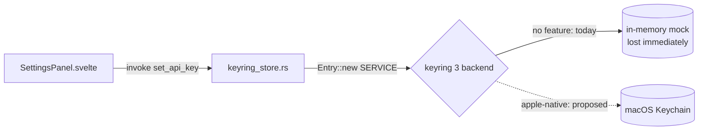

# API Key Storage — Notice (v0)

Date: 2026-10-05

---
type: notice
title: Enable the macOS Keychain backend for API keys
tag: gap
effort: S
reversibility: easy (one Cargo feature)
evidence: verified
spotted-during: update-flow-hardening campaign, native E2E keychain probe (e2e_native leaf)
date: 2026-10-05
status: resolved
---

## TL;DR
- Turn on keyring's `apple-native` feature so Settings API keys are actually stored.
- Today every saved API key is lost: keyring falls back to an in-memory mock.
- Ad-hoc signed updates may then trigger Keychain access prompts after each update.

## Context
`src-tauri/Cargo.toml` declares `keyring = "3"` with no platform feature. In keyring 3.6.3 that selects the mock store (`pub use mock as default`). The native E2E probe saw `set_api_key` succeed, then `get_api_key` fail ("No matching entry found in secure storage") in the same process. `cargo tree -e features -i keyring` lists only `default`. The bug predates the updater work: `main` has the same line.

## Scope Delta
- `src-tauri/Cargo.toml`: `keyring = { version = "3", features = ["apple-native"] }`. Releases are macOS-only.
- `src-tauri/src/keyring_store.rs`: unchanged API. The `SIFT_KEYRING_SERVICE` compile-time override (from e2e_native) lets tests use `sift-e2e`.
- `scripts/e2e-updater.sh`: the keychain probe stops being vacuous. Re-run it to see whether macOS prompts after an update swaps an ad-hoc-signed bundle.
- Possible follow-on: a stable signing identity or a keychain access group, if update-time prompts appear.
- User-facing: existing users must re-enter their API keys once, because nothing was ever persisted.

## Accept / Decline

| | Accept | Decline |
|---|---|---|
| **Benefit** | API keys persist across launches and updates; Settings behaves as users expect | The update-flow campaign ships 0.2.0 without touching credential storage or signing |
| **Cost** | One feature flag plus an E2E re-run. May surface Keychain prompts tied to ad-hoc code identity, which need a signing decision | Users keep re-entering API keys every launch, and the OCR pipeline fails until they do |

## If Accepted — Next Step
Open a dedicated thread: enable `apple-native`, verify persistence with `SIFT_KEYRING_SERVICE=sift-e2e`, then run `scripts/e2e-updater.sh` and record whether an update triggers a Keychain prompt.

## If Declined — Next Step
Deferred (2026-10-05) by the maintainer to a future feature update. Revisit right after v0.2.0 ships. Tracked as a Reminder in the "Sift" list.

## Resolution
Accepted after v0.2.0 shipped and fixed in campaign `__roadmap__/keychain-persistence` (2026-10-06). `src-tauri/Cargo.toml` now declares `keyring = { version = "3", features = ["apple-native"] }`, and the test `backend_persists_until_delete` pins the real backend. The keychain probe is no longer vacuous: the native E2E asserts that 0.0.1 writes the item. The update-time question is answered in [`01-keychain_signing_measurement_v0.md`](01-keychain_signing_measurement_v0.md). Under ad-hoc signing, after each update macOS asks for the login keychain password once per stored key. The OCR key and the text-processing key are separate items, and "Always Allow" covers only the item it was asked for. Self-signing does not avoid it. The maintainer accepted that, so no signing change was made.
